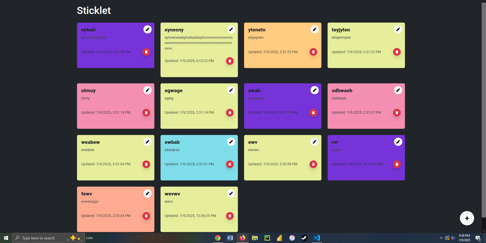
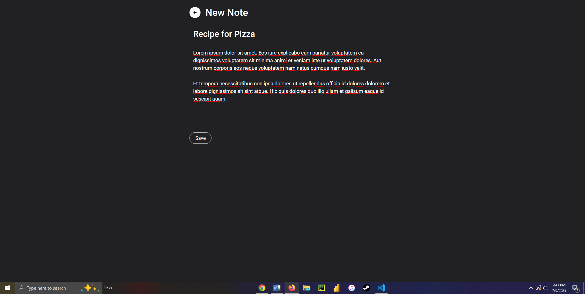

## 🗒️ Sticklet

A sleek, desktop-focused sticky notes app inspired by Apple Notes in dark mode.
Built with TypeScript, Firebase Firestore, and React for persistent note-taking in the cloud.
✨ Features

    Create, read, update, and delete sticky notes

    Each note includes a title, body, timestamp, and unique color

    Notes are stored in Firestore for real-time syncing and persistence

    Notes appear in a responsive grid layout, sorted by last update

    Colors alternate to avoid duplicate adjacent hues

    Timestamp shown in local Central Time (MM-DD-YYYY, 12-hour format with AM/PM)

    Floating circular "+" button to add new notes

    Edit and delete options available directly on each note

    Dark mode UI with sleek, minimal styling and pastel tones

## 🧰 Tech Stack

    React with TypeScript

    React Router for page navigation

    Firebase Firestore for cloud-based persistence

    Bootstrap 5 for layout and responsive styling

    React Icons for intuitive, clean icons

    Google Fonts (Roboto) for clean, modern typography

## Screenshots

  

  

## 📁 Project Structure

src/
├── components/
│   ├── FloatingButton.tsx    # Floating "+" button to create a new note
│   ├── NoteCard.tsx          # Individual sticky note cards
├── pages/
│   ├── Home.tsx              # Main page showing all notes
│   ├── NewNote.tsx           # Page to create a new note
│   ├── EditNote.tsx          # Page to edit an existing note
├── utils.ts                  # Helper functions for colors, formatting
├── firebase.ts               # Firebase initialization and config
├── App.tsx                   # Main app and router configuration
├── index.css                 # Global styles (dark mode, fonts)
├── App.css                   # Additional app-wide styles
└── main.tsx                  # Application entry point

## 🚀 Getting Started
1. Clone the Repository

git clone https://github.com/your-username/sticklet.git
cd sticklet

2. Install Dependencies

npm install

3. Set Up Firebase

    Create a Firebase project at console.firebase.google.com

    Enable Firestore Database in test mode

    Copy your Firebase config object and replace the values in src/firebase.ts

4. Start the App

npm run dev

Visit http://localhost:3000 to start using the app locally.

## 📝 Notes

    Firestore handles all note storage, syncing, and persistence

    All note timestamps are saved in UTC and formatted in Central Time for display

    Notes are assigned alternating pastel colors for a clean visual layout

    Edit and delete actions are handled in real-time, synced with Firestore